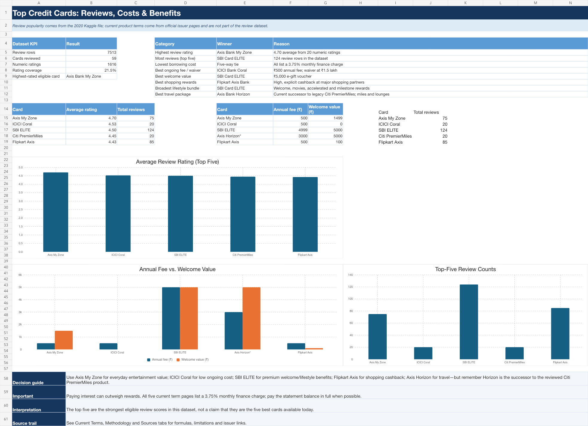

# Credit Card Review Analysis

An end-to-end consumer credit-card analysis that combines 7,513 public review records with current issuer pricing, welcome offers, rewards, and benefits.

The project answers two separate questions:

1. Which cards received the strongest eligible consumer-review scores in the dataset?
2. Which of those cards currently provides the best value for borrowing cost, annual fee, welcome bonus, shopping rewards, lifestyle benefits, or travel?



## Project highlights

- Analyzed **7,513 reviews** covering **59 credit cards**.
- Identified **1,616 usable numeric ratings**, representing 21.5% of review rows.
- Required at least **20 numeric ratings** before a card could enter the top five.
- Used a Bayesian-adjusted score to reduce the influence of small samples.
- Verified current product terms using official Axis Bank, ICICI Bank, and SBI Card pages.
- Built a formula-driven Excel workbook, native charts, and a ten-page case-study report.

## Top five reviewed cards

| Rank | Reviewed card | Total reviews | Numeric ratings | Average rating | Bayesian score |
|---:|---|---:|---:|---:|---:|
| 1 | Axis Bank Myzone Credit card | 75 | 20 | 4.70 | 3.969 |
| 2 | ICICI CORAL VISA CONTACTLESS | 20 | 20 | 4.53 | 3.881 |
| 3 | SBI ELITE | 124 | 20 | 4.50 | 3.869 |
| 4 | CITIBANK PREMIERMILES | 20 | 20 | 4.45 | 3.844 |
| 5 | AXIS FLIPKART | 85 | 20 | 4.43 | 3.831 |

## Category leaders

| Category | Leader | Reason |
|---|---|---|
| Highest review rating | Axis Bank My Zone | 4.70 average from 20 numeric ratings |
| Most reviewed among the top five | SBI Card ELITE | 124 review rows |
| Lowest borrowing cost | Five-way tie | Each current product lists a 3.75% monthly finance charge |
| Best ongoing fee and waiver | ICICI Bank Coral | ₹500 annual fee, waived at ₹1.5 lakh annual spend |
| Best welcome offer | SBI Card ELITE | ₹5,000 e-gift voucher |
| Best shopping rewards | Flipkart Axis Bank | High, clearly defined partner cashback rates |
| Broadest lifestyle benefits | SBI Card ELITE | Welcome voucher, movies, accelerated rewards, and milestones |
| Best travel package | Axis Bank Horizon | Airline/travel miles and lounge access; successor caveat applies |

> **Legacy-product note:** the review score belongs to Citi PremierMiles. Current pricing and travel benefits are shown for Axis Horizon, the migrated successor, and are not historical Citi terms.

## Methodology

Cards were grouped by exact card name. For each card, the analysis calculated total reviews, numeric-rating count, average rating, and a Bayesian-adjusted score:

```text
Weighted score = (n × card mean + 20 × global mean) ÷ (n + 20)
```

The global numeric-rating mean was 3.237. Only cards with at least 20 numeric ratings were eligible for the top-five ranking.

Issuer pages publish a monthly finance charge rather than a U.S.-style APR. The workbook therefore provides a normalized comparison:

```text
Effective annualized rate = (1 + monthly finance charge)^12 − 1
```

A 3.75% monthly finance charge equals approximately 55.55% effective annualized.

See [docs/METHODOLOGY.md](docs/METHODOLOGY.md) for the complete process and limitations.

## Repository contents

```text
credit-card-review-analysis/
├── analysis/
│   └── credit_card_review_analysis.xlsx
├── data/
│   ├── raw/All_Reviews.xlsx
│   ├── processed/card_ranking.csv
│   ├── processed/current_terms.csv
│   └── processed/top_five_credit_cards.csv
├── docs/
│   ├── METHODOLOGY.md
│   └── SOURCES.md
├── images/
│   ├── dashboard.png
│   ├── fee_welcome_chart.png
│   ├── rating_chart.png
│   └── review_count_chart.png
├── report/
│   └── credit_card_review_analysis.pdf
├── src/analyze_credit_cards.py
├── CITATION.cff
├── CONTRIBUTING.md
├── LICENSE
├── requirements.txt
└── README.md
```

## Reproduce the analysis

```bash
python -m venv .venv
source .venv/bin/activate
pip install -r requirements.txt
python src/analyze_credit_cards.py
```

The script reads `data/raw/All_Reviews.xlsx` and recreates the processed ranking files. The committed charts were generated from the formula-driven Excel workbook.

## Deliverables

- [Excel analysis workbook](analysis/credit_card_review_analysis.xlsx)
- [Case-study PDF](report/credit_card_review_analysis.pdf)
- [Interactive Google Doc report](https://docs.google.com/document/d/1jtIO6Pto2IyVWJGy_9dO-KrbuTTJK7tw2HE1u3aZOro/edit)
- [Methodology](docs/METHODOLOGY.md)
- [Primary sources](docs/SOURCES.md)

## Limitations

- The reviews are India-specific, self-selected, and published no later than 2020.
- Only 21.5% of review rows contain numeric ratings.
- Review volume is not the same as cardholder count or market share.
- Current issuer offers, caps, taxes, eligibility rules, and fees can change.
- Results are directional and should not be interpreted as causal or representative of the full market.

## Data license and attribution

The review data comes from the public [Credit Card Reviews dataset on Kaggle](https://www.kaggle.com/datasets/arjunanc/credit-card-reviews), published by Arjun N C under CC0. Current product terms are attributed to their official issuer pages in [docs/SOURCES.md](docs/SOURCES.md).

Project code and original documentation are available under the [MIT License](LICENSE).
